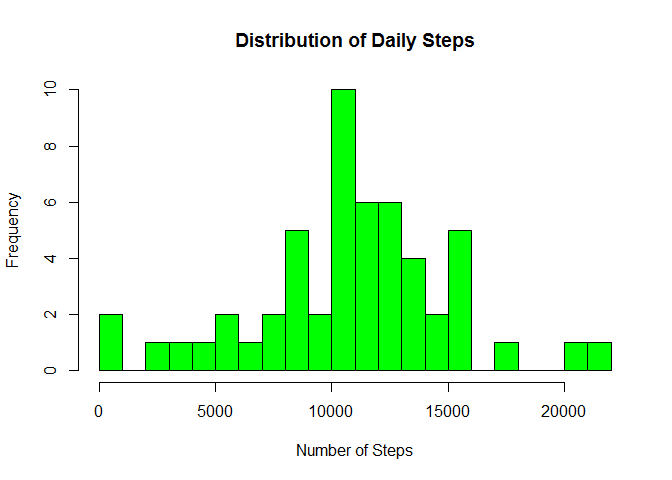

# Reproducible Research: Peer Assessment 1


This is the Reproducible Research - Project 1 of Coursera Data Science Specialization, it will answer a few questions about a data collected from monitoring devices.


#Loading and processing the data
(1) Load the data

```r
#Load the data
activity <- read.csv("activity.csv", head=TRUE, na.strings="NA")
```
(2) Process the data

```r
#set date format
activity$date <- as.Date(activity$date)
```
#What is mean total number of steps taken per day?
(1) Calculate the total number of steps taken per day

```r
dailySteps <- aggregate(steps ~ date, activity, sum, na.rm = TRUE)
head(dailySteps)
```

```
##         date steps
## 1 2012-10-02   126
## 2 2012-10-03 11352
## 3 2012-10-04 12116
## 4 2012-10-05 13294
## 5 2012-10-06 15420
## 6 2012-10-07 11015
```
(2) Histogram of total number of steps taken each day


```r
hist(dailySteps$steps, main = paste("Distribution of Daily Steps"), col="green", xlab="Number of Steps", breaks=20)
```

<!-- -->

(3) Mean and Median number of steps taken each day


```r
#Mean
stepsMeans <- mean(dailySteps$steps)
stepsMeans
```

```
## [1] 10766.19
```

```r
#Median
stepsMedian <- median(dailySteps$steps)
stepsMedian
```

```
## [1] 10765
```

# What is the average daily activity pattern?
(1) Make a time series plot (i.e. type = "l") of the 5-minute interval (x-axis) and the average number of steps taken, averaged across all days (y-axis)

```r
avgStepsPerTime <- aggregate( steps ~ interval , data=activity, FUN=mean, na.rm = TRUE)
with(avgStepsPerTime,
     plot(interval, steps, type="l", xlab="5-minute intervals", ylab="Average steps per interval across all days"))
```

<!-- -->

(2) Which 5-minute interval, on average across all the days in the dataset, contains the maximum number of steps?

```r
avgStepsPerTime[which.max(avgStepsPerTime$steps),]
```

```
##     interval    steps
## 104      835 206.1698
```

# Imputing missing values
(1) Calculate and report the total number of missing values in the dataset (i.e. the total number of rows with NAs)

```r
sum(is.na(activity$steps))
```

```
## [1] 2304
```
(2)  Devise a strategy for filling in all of the missing values in the dataset. The strategy does not need to be sophisticated. For example, you could use the mean/median for that day, or the mean for that 5-minute interval, etc.

```r
dailyStepsImputed <- activity
#dailyStepsA holds the available values
dailyStepsA <- subset(activity, !is.na(activity$steps))
#naIndex indicates the rows of NA values
naIndex <- is.na(dailyStepsImputed$steps)
#intAve holds the average vales to be used for NA values
intAvg <- tapply(dailyStepsA$steps, dailyStepsA$interval, mean, na.rm=TRUE, simplify=T)
```
(3) Create a new dataset that is equal to the original dataset but with the missing data filled in.

```r
#Substitute NA values
dailyStepsImputed$steps[naIndex] <- intAvg[as.character(dailyStepsImputed$interval[naIndex])]
#newDailyTotal is the imputed dataset
newDailyTotal <- tapply(dailyStepsImputed$steps, dailyStepsImputed$date, sum, na.rm=TRUE, simplify=T)
```
(4) Make a histogram of the total number of steps taken each day

```r
hist(x=newDailyTotal,
     col="blue",
     breaks=20,
     xlab="Daily Steps",
     ylab="Frequency",
     main="The distribution of daily total (with missing data imputed)")
```

<!-- -->
(4.1) Calculate and report the mean and median total number of steps taken per day


```r
#Imputed Mean
imputedMeans <- mean(newDailyTotal)
imputedMeans
```

```
## [1] 10766.19
```

```r
#Imputed Median
imputedMedian <- median(newDailyTotal)
imputedMedian
```

```
## [1] 10766.19
```
(4.2) Do these values differ from the estimates from the first part of the assignment?
No, because the value that was populated was the mean. 
(4.3)What is the impact of imputing missing data on the estimates of the total daily number of steps?
There is no impact of imputing missing data

# Are there differences in activity patterns between weekdays and weekends?
(1) Create a new factor variable in the dataset with two levels - "weekday" and "weekend" indicating whether a given date is a weekday or weekend day.

```r
library(dplyr)
dailyStepsDays <- mutate(dailyStepsImputed, WeekDay = weekdays(dailyStepsImputed$date))
dailyStepsDays <- mutate(dailyStepsDays, WeekDay = ifelse (weekdays(dailyStepsDays$date) == "Saturday" | weekdays(dailyStepsDays$date) == "Sunday", "weekend", "weekday"))
```
(2) Make a panel plot containing a time series plot (i.e. type = "l") of the 5-minute interval (x-axis) and the average number of steps taken, averaged across all weekday days or weekend days (y-axis).

```r
dailyStepsDays <- aggregate(steps ~ interval+WeekDay, dailyStepsDays, mean)

library(lattice)
xyplot(steps ~ interval | factor(WeekDay),
       layout = c(1, 2),
       xlab="Interval",
       ylab="Number of steps",
       type="l",
       lty=1,
       data=dailyStepsDays)
```

<!-- -->
